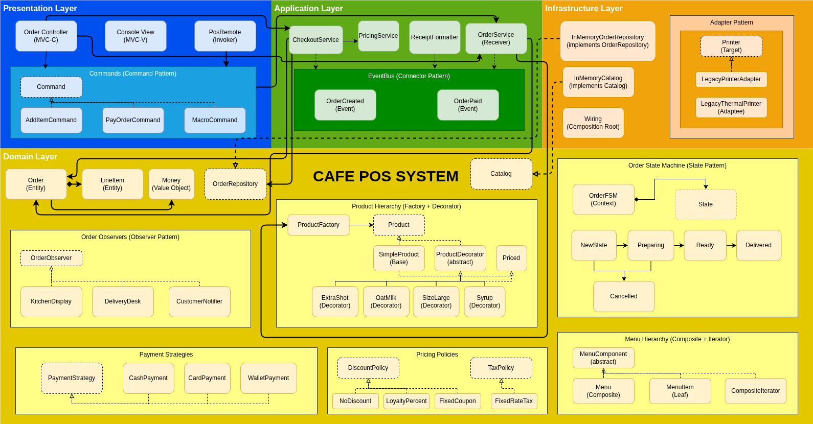
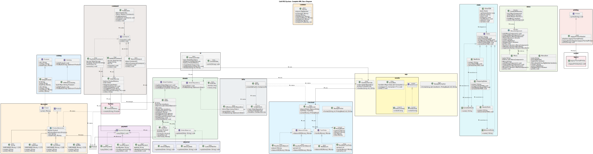

# Café POS System

## Architecture





## Architectural Trade-offs: Layering vs Partitioning

### Context

As our Café POS project grew through weeks 8-11 with the addition of Command, Adapter, Composite, Iterator, State, MVC, and EventBus patterns, we needed to make a decision on how to structure the system. The main question we faced was whether to keep everything as a layered monolith or partition into microservices from the start.

### Alternatives We Considered

We evaluated three different architectural approaches:

**1. Layered Monolith**
- Single deployable JAR with four clear layers (Presentation, Application, Domain, Infrastructure)
- In-process method calls between components
- Simple deployment model

**2. Microservices Architecture**
- Separate services for Orders, Payments, Notifications, Inventory, and Analytics
- Each service deploys independently
- Communication via REST APIs and message queues

**3. Modular Monolith**
- Single deployment unit with strict module boundaries
- Enforced separation via build tools
- Easier to extract into services later if needed

### Our Decision: Layered Monolith Approach

We chose a layered monolithic architecture (for now) with four clear layers (Presentation, Application, Domain, Infrastructure) rather than partitioning into multiple services for several reasons.

A single deployable service is easier to develop, test, and deploy for a small café POS system such as this. There was no need to overcomplicate things for such a small project with a defined scope. Performance was also taken into consideration, as in-process method calls are faster than network communication. With a monolith architecture, development speed is quicker as there are no complexity issues due to distributed systems such as API contracts, network communication, and consistency issues (all learned about simultaneously in another module, Applied System Design with Andrew Ju). On top of all that, as we were such a small team of 2, working in a single codebase was not awkward and actually helped with our understanding of the system.

### Trade-offs

**What we gained:**
- Simple deployment - just one JAR file to run
- Fast in-process communication with no network overhead
- Easier debugging with the entire call stack visible in one place
- Straightforward testing without needing to mock network calls
- Simple transaction boundaries without distributed coordination

**What we gave up:**
- Cannot scale individual components independently (if Payments get heavy load, we have to scale the entire application)
- Any change requires full system redeployment
- Locked into a single technology stack for the entire system
- Potential for layer boundary violations if we're not disciplined
- If one component crashes severely, it could bring down the whole system

### Future Partitioning Candidates

In our opinion, the natural seams for future microservices include:

- **Payment Service**: An external payment gateway integration could be isolated with clear transactional boundaries
- **Notification Service**: Kitchen displays, customer SMS, and delivery alerts could run independently via event streaming
- **Analytics Service**: Order metrics and reporting don't need real-time synchronous access to the core POS system
- **Inventory Service**: Update menu accordingly and could integrate with suppliers

These seams seem obvious to us as they have clear boundaries and different scaling needs. They could all fail independently without bringing down our whole POS system.

### Connectors for Distributed Architecture

Currently we do direct method calls (e.g., `controller.checkout(orderId);`) which have benefits such as being in-process, fast, and simple. However, if splitting services into a distributed system, we would use:

- **REST APIs** for synchronous operations such as checkout and order queries. These API endpoints will be used when an immediate response is needed.
- **Message Queues** (RabbitMQ/Kafka learned in Applied System Design module) for asynchronous events such as order created and payment processed. They are useful for fire-and-forget actions, multiple consumers, and for when eventual consistency is okay. Could be used for notifications and analytics.
- **Event Bus** pattern would become a distributed message broker
- **API Gateway** for frontend to access multiple services through a single endpoint

Our current EventBus demonstrates the publish-subscribe pattern that would scale to a message broker in a distributed system.

### Connection to Our Architecture

As shown in our architecture diagram, the EventBus sits in the Application layer and acts as a connector between components. It already decouples the Presentation layer from direct domain access by using events and application services. When domain events occur (such as `OrderPaid`), application services react to them through the EventBus.

This design means the EventBus is the natural seam where we would introduce network boundaries if we needed to partition into services. The Repository pattern (with `OrderRepository` interface and `InMemoryOrderRepository` implementation) is another clear seam - we could swap the implementation for a database or even a REST client calling an external Order Service without changing any domain code.

## Build & Run

```bash
# Compile
mvn compile

# Run tests
mvn test

# Run the interactive demo
mvn compile exec:java -Dexec.mainClass="com.cafepos.demo.InteractiveDemo"
```

## Project Structure

```
src/main/java/com/cafepos/
├── app/            # Application layer (use cases, services)
├── domain/         # Domain layer (Order, LineItem, repositories)
├── infra/          # Infrastructure layer (persistence, wiring)
├── ui/             # Presentation layer (controller, view)
├── catalog/        # Product catalog
├── checkout/       # Pricing and discount policies
├── command/        # Command pattern implementation
├── decorator/      # Product decorators (extras, size)
├── factory/        # Product factory
├── menu/           # Composite menu structure
├── observer/       # Order observers (kitchen, delivery)
├── payment/        # Payment strategies
├── printing/       # Printer adapter
├── state/          # Order state machine
└── demo/           # Demo applications
```